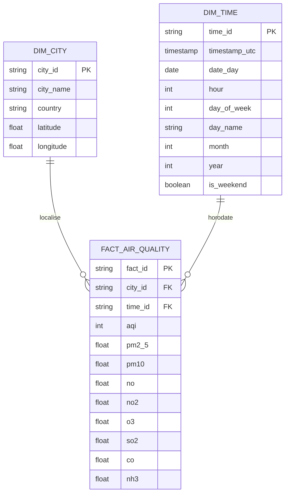

Ces fichiers constituent la sauvegarde brute et la source de vérité : `clean/` est entièrement reconstruit à partir d'eux, à chaque exécution du pipeline (`scripts/stockage/build_clean.py` gère les deux formats).

## Contrat de données — `clean/air_quality_clean.csv`

Un seul fichier, reconstruit à chaque run depuis `raw/`. Une ligne = une (ville, heure). Trié chronologiquement. Sans doublon (déduplication sur ville + heure/timestamp).

| Colonne | Type | Unité / format | Description |
|---|---|---|---|
| city | string | — | Nom de la ville |
| country | string | nom complet | Pays (ex. "France") |
| lat | float | degrés décimaux | Latitude |
| lon | float | degrés décimaux | Longitude |
| timestamp | int | Unix timestamp (UTC) | Horodatage de la mesure |
| datetime_utc | string | ISO 8601 (UTC) | Horodatage lisible de la mesure |
| aqi | int | **échelle OpenWeatherMap 1-5** (1=Good ... 5=Very Poor) | Attention : ce n'est PAS l'échelle US EPA 0-500 |
| co | float | µg/m³ | Monoxyde de carbone |
| no | float | µg/m³ | Monoxyde d'azote |
| no2 | float | µg/m³ | Dioxyde d'azote |
| o3 | float | µg/m³ | Ozone |
| so2 | float | µg/m³ | Dioxyde de soufre |
| pm2_5 | float | µg/m³ | Particules fines < 2.5 µm |
| pm10 | float | µg/m³ | Particules fines < 10 µm |
| nh3 | float | µg/m³ | Ammoniac |

## Schéma du Data Warehouse (Neon PostgreSQL)

Modélisation en étoile : une table de faits + deux dimensions.

**`fact_air_quality`** — une ligne par (ville, heure) mesurée :
- `fact_id` (PK)
- `city_id` (FK → `dim_city`)
- `time_id` (FK → `dim_time`)
- `aqi`, `pm2_5`, `pm10`, `no`, `no2`, `o3`, `so2`, `co`, `nh3`
- contrainte d'unicité sur `(city_id, time_id)`

**`dim_city`** :
- `city_id` (PK)
- `city_name`, `country`, `latitude`, `longitude`

**`dim_time`** :
- `time_id` (PK, format `AAAA-MM-JJ-HH`)
- `timestamp_utc` (horodatage complet)
- `date_day` (date)
- `hour` (heure, 0-23)
- `day_of_week` (1-7, ISO)
- `day_name` (nom du jour, ex. "Monday")
- `month`, `year`
- `is_weekend` (booléen)

Aucune mesure dans les dimensions, aucune colonne descriptive (ville, coordonnées) dans la table de faits — conforme aux règles de modélisation dimensionnelle du cours.

## Période couverte

- **Début des données** : 1er avril 2026, 00h00 UTC
- **Fin** : en continu, mise à jour toutes les heures via le pipeline automatisé (GitHub Actions, `cron: '17 * * * *'`)
- **Couverture actuelle** : ~4 mois (avril → juillet 2026) pour les 5 villes.

## Cohérence des données et trous connus

Au moment de la rédaction : 0,51 % de lignes manquantes au global (75 lignes sur un total attendu de villes × heures), réparties de façon homogène entre les 5 villes. Ce taux était initialement de 3,01 % (135 heures manquantes par ville, soit 4,7 % chacune) avant l'exécution de deux campagnes de backfill successives (`AQI Backfill Pipeline`), qui ont permis de combler la majorité des trous en récupérant l'historique manquant via l'endpoint `/air_pollution/history`.

**Cause des écarts résiduels** : le pipeline est déclenché par un workflow GitHub Actions planifié (`cron: '17 * * * *'`, soit toutes les heures). GitHub ne garantit pas l'exactitude temporelle de l'exécution des workflows planifiés : sous forte charge de l'infrastructure GitHub Actions, certains runs peuvent être retardés de plusieurs minutes, voire sautés entièrement (comportement documenté par GitHub, indépendant du code du pipeline), un effet amplifié par notre paramètre `concurrency: cancel-in-progress: false`, qui empêche deux runs de tourner simultanément. Le fait que le taux de trous résiduel reste homogène entre les 5 villes confirme qu'il s'agit de runs entiers sautés, et non d'erreurs API isolées par ville. Ces trous n'affectent pas la cohérence des données déjà collectées (extraction idempotente : aucun doublon, aucune donnée corrompue).

## Infos de connexion à la base

Base PostgreSQL hébergée sur [Neon](https://neon.tech). Trois rôles distincts :
- **`neondb_owner`** : rôle propriétaire Neon, usage interne (vérifications, administration).
- **`dw_writer`** : lecture/écriture complète, utilisé exclusivement par `load_warehouse.py` pour charger le warehouse.
- **`ia1_reader`** : **lecture seule, destiné à la consommation des données par le cours IA1**. C'est ce rôle qui doit être utilisé pour toute requête externe au pipeline.

Les chaînes de connexion complètes sont stockées en tant que secrets (variables d'environnement `DATABASE_URL` et `DATABASE_URL_WRITER`), jamais committées dans le dépôt. Voir `.env.example` à la racine pour le format attendu, et les secrets GitHub Actions (`NEON_DATABASE_URL`, `NEON_DATABASE_URL_WRITER`) pour l'exécution automatisée. Pour obtenir une chaîne de connexion en lecture seule (`ia1_reader`) à donner au cours IA1, contactez [responsable du groupe / voir rapport de projet].

## Rejouabilité

- **Extraction courante / backfill** : `scripts/extraction/extract_aqi.py` (rejouable, idempotent — ne réécrit pas les fichiers `raw/` déjà présents) et `scripts/extraction/backfill_aqi.py` (backfill mensuel groupé, rejouable)
- **Reconstruction de `clean/`** : `scripts/stockage/build_clean.py` (reconstruit entièrement le CSV depuis `raw/` à chaque exécution)
- **Chargement du warehouse** : `scripts/warehouse/load_warehouse.py` (rejouable, idempotent, upsert sur `(city_id, time_id)`)